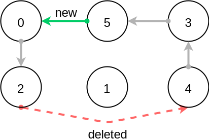

*****************************************************************
Part 5: Circuit Constraint, TSP and LNS
*****************************************************************

*We ask you not to publish your solutions on a public repository.
The instructors interested to get the source-code of
the solutions can contact us.*

Slides
======

* `Circuit Constraint <https://www.icloud.com/keynote/085FmanDku6kwb-W78j_KgidQ#05a-circuit>`_
* `CP Branch and Bound Optimization and Large Neighborhood Search <https://www.icloud.com/keynote/0B3GvwWzrQQugkCyRkmlPlHIg#05b-optim-lns>`_

Theoretical questions
=====================

* `Circuit <https://inginious.org/course/minicp/circuit>`_
* `LNS <https://inginious.org/course/minicp/lns>`_

Circuit Constraint
========================

The circuit constraint enforces an hamiltonian circuit on a successor array.
On the next example the successor array is `[2,4,1,5,3,0]`

.. image:: ../_static/circuit.svg
    :scale: 50
    :width: 250
    :alt: Circuit

All the successors must be different.
But enforcing the `allDifferent` constraint is not enough.
We must also guarantee it forms a proper circuit (without sub-tours).
This can be done efficiently and incrementally by keeping track of the sub-chains
appearing during the search.
The data-structure for the sub-chains should be a reversible.
Our instance variables used to keep track of the sub-chains are:

.. code-block:: java

    IntVar [] x;
    ReversibleInt [] dest;
    ReversibleInt [] orig;
    ReversibleInt [] lengthToDest;

* `dest[i]` is the furthest node we can reach from node `i` following the instantiated edges.
* `orig[i]` is the furthest node we can reach from node `i` following instantiated edges in reverse direction.
* `lengthToDest[i]` is the number of instantiated edges on the path from node `i` to `dest[i]`.

Consider the following example with instantiated edges colored in grey.

Before the addition of the green link we have

.. code-block:: java

    dest = [2,1,2,5,5,5];
    orig = [0,1,0,4,4,4];
    lengthToDest = [1,0,0,1,2,0];

After the addition of the green link we have

.. code-block:: java

    dest = [2,1,2,2,2,2];
    orig = [4,1,4,4,4,4];
    lengthToDest = [1,0,0,3,4,2];

In your implementation you must update the reversible integers to reflect
the change after the addition of every new edge.
You can use the `CPIntVar.whenBind(...)` method for that.

The filtering in itself consists in preventing to close a
sub-tour that would have a length less than `n` (the number of nodes).
Since node 4 has a length to destination (node 2) of 4 (<6), the destination node 2 can not have 4 as successor
and the red link is deleted.
This filtering was introduced in [TSP1998]_ for solving the TSP with CP.

Implement `Circuit.java <https://bitbucket.org/minicp/minicp/src/HEAD/src/main/java/minicp/engine/constraints/Circuit.java?at=master>`_.

Check that your implementation passes the tests `CircuitTest.java <https://bitbucket.org/minicp/minicp/src/HEAD/src/test/java/minicp/engine/constraints/CircuitTest.java?at=master>`_.

.. [TSP1998] Pesant, G., Gendreau, M., Potvin, J. Y., & Rousseau, J. M. (1998). An exact constraint logic programming algorithm for the traveling salesman problem with time windows. Transportation Science, 32(1), 12-29.

Custom search for TSP
=================================

Modify `TSP.java <https://bitbucket.org/minicp/minicp/src/HEAD/src/main/java/minicp/examples/TSP.java?at=master>`_
to implement a custom search strategy.
A skeleton is the following one:

.. code-block:: java

        DFSearch dfs = makeDfs(cp,
                selectMin(succ,
                        succi -> succi.getSize() > 1, // filter
                        succi -> succi.getSize(), // variable selector
                        succi -> {
                            int v = succi.getMin(); // value selector (TODO)
                            return branch(() -> equal(succi,v),
                                    () -> notEqual(succi,v));
                        }
                ));

* The unbound variable selected is one with smallest domain (first-fail).
* It is then assigned the minimum value in the domain.

This value selection strategy is not well suited for the TSP (and VRP).
The one you design should be more similar to the decision you would
make manually in a greedy fashion.
For instance you can select as a successor for `succi`
the closest city in the domain.

Hint: Since there is no iterator on the domain of a variable, you can
iterate from the minimum value to the maximum one using a for loop
and check if it is in the domain with the `contains` method.

You can also implement a min-regret variable selection strategy.
It selects the variable with the largest different between the closest
successor city and the second closest one.
The idea is that it is critical to decide the successor for this city first
because otherwise you will regret it the most.

Observe the first solution obtained and its objective value ?
Is it better than the naive first fail ?
Also observe the time and number of backtracks necessary for proving optimality.
By how much did you reduce the computation time ?

LNS applied to TSP
=================================================================

Modify further `TSP.java <https://bitbucket.org/minicp/minicp/src/HEAD/src/main/java/minicp/examples/TSP.java?at=master>`_
to implement a LNS search.
Use the larger 17x17 distance matrix for this exercise.

What you should do:

* Record the assignment of the current best solution. Hint: use the `onSolution` call-back on the `DFSearch` object.
* Implement a restart strategy fixing randomly '10%' of the variables to their value in the current best solution.
* Each restart has a failure limit of 100 backtracks.

An example of LNS search is given in  `QAPLNS.java <https://bitbucket.org/minicp/minicp/src/HEAD/src/main/java/minicp/examples/QAPLNS.java?at=master>`_.
You can simply copy/paste/modify this implementation for the TSP.

* Does it converge faster to good solutions than the standard DFS ? Use the larger instance with 25 facilities.
* What is the impact of the percentage of variables relaxed (experiment with 5, 10 and 20%) ?
* What is the impact of the failure limit (experiment with 50, 100 and 1000)?
* Which parameter setting work best? How would you choose it?
* Imagine a different relaxation specific for this problem. Try to relax with higher probability the decision variables that have the strongest impact on the objective (the relaxed variables should still be somehow randomized). You can for instance compute for each facility $i$: $sum_j d[x[i]][x[j]]*w[i][j]$ and base your decision to relax or not a facilities on those values.

From TSP to VRP
=================================================================

Create a new file further `VRP.java` working with the exact same distance matrix as the TSP but assuming
that there are now :math:`k` vehicles (make it a parameter and experiment with :math:`k=3` ).
The depot is the city at index `0`, every other cities must be visited exactly once by any of the k vehicles.

* variant1:  minimize the total distance travelled by the three vehicles
* variant2 (more advanced): minimize the longest distance travelled by the three vehicles (in order to be fair among the vehicle drivers)

You can also use LNS to speed-up the search.
