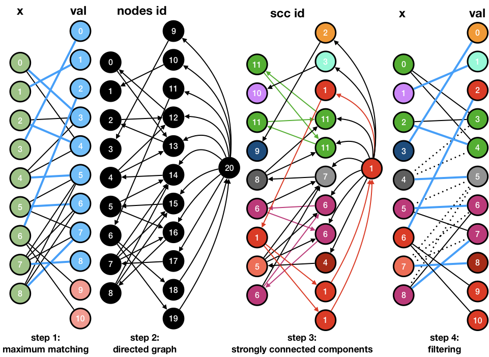

*****************************************************************
Part 6: AllDifferent Constraint
*****************************************************************

*We ask you not to publish your solutions on a public repository.
The instructors interested to get the source-code of
the solutions can contact us.*

Slides
======

`Lectures on Youtube <https://youtube.com/playlist?list=PLq6RpCDkJMyrExrxGKIuE5QixGhoMugKw>`_

* `AllDifferent Constraint <https://www.icloud.com/keynote/0dCFUILn1rSOatVpn4t0pVGxg#06-alldifferent>`_

Theoretical questions
=====================

* `AllDifferent <https://inginious.org/course/minicp/alldifferent>`_

Forward checking filtering
=========================================

Implement a dedicated propagator `AllDifferentFW.java` for the all-different that does the same-filtering
as `AllDifferentACBinary.java <https://bitbucket.org/minicp/minicp/src/HEAD/src/main/java/minicp/engine/constraints/AllDifferentBinary.java?at=master>`_ .
but avoid to iterate over bound-variables when removing a value.
Implement the sparset-trick, similarly as the `Sum.java <https://bitbucket.org/minicp/minicp/src/HEAD/src/main/java/minicp/engine/constraints/Sum.java?at=master>`_ constraint.
Experiment with the 15-Queens problem. How much speedup do you observe for searching all the solutions.

Domain consistent filtering
===================================

The objective here is to implement the filtering algorithm described in  [REGIN94]_
to remove every impossible value for the `AllDifferent` constraint (Arc-Consistency).
More precisely you must:

* Implement the constraint `AllDifferentAC.java <https://bitbucket.org/minicp/minicp/src/HEAD/src/main/java/minicp/engine/constraints/AllDifferentAC.java?at=master>`_.
* Test your implementation in `AllDifferentACTest.java. <https://bitbucket.org/minicp/minicp/src/HEAD/src/test/java/minicp/engine/constraints/AllDifferentACTest.java?at=master>`_

Régin's algorithm proceeds in four steps described in the following figure.

1. It computes an initial maximum matching in the variable value graph for the consistency test.
2. It build an oriented graph. Matched edges from right to left, un matched edge from left to right. There is also one dummy node
   with in-comming edges from unmatched value nodes, and out-going edges toward matched value nodes.
3. It computes strongly connected components.
4. Any edge that is not in the initial maximum matching and connects two nodes from different components is removed.

The two main algorithmic building blocks are provided.

* `MaximumMatching.java <https://bitbucket.org/minicp/minicp/src/HEAD/src/main/java/minicp/engine/constraints/MaximumMatching.java?at=master>`_
  is a class that computes a maximum matching given an array of variables. Instantiate this class once and for all in the constructor
  then you should simply call `compute` in the `propagate` method.
* `GraphUtil.java <https://bitbucket.org/minicp/minicp/src/HEAD/src/main/java/minicp/util/GraphUtil.java?at=master>`_
  contains a static method with signature `public static int[] stronglyConnectedComponents(Graph graph)` to compute strongly connected
  components. The returned array gives from each node, the connected component id.

One of the main difficulty of this exercise is to implement the `Graph` interface
to represent the residual graph of the maximum matching.

.. code-block:: java

    public static interface Graph {
        /* the number of nodes in this graph */
        int n();

        /* incoming nodes ids incident to node idx */
        Iterable<Integer> in(int idx);

        /* outgoing nodes ids incident to node idx */
        Iterable<Integer> out(int idx);
    }

It uses an adjacency list that is updated in the method `updateGraph()`.
We advise you to use a dense representation with node ids as illustrated on the black nodes of the example (step2: directed graph).

Once your code passes the tests, you can experiment your new constraint on all the models you have seen so far
to measure the pruning gain on the number of nodes (NQueens, Eternity, TSP, QAP, etc).

.. [REGIN94] Régin, J.-C. (1994). A filtering algorithm for constraints of difference in CSPs, AAAI-94
